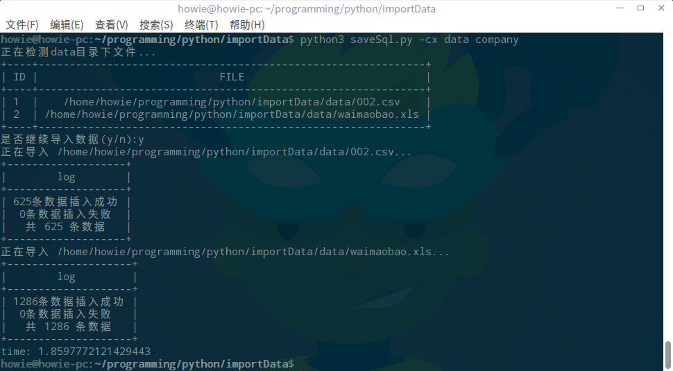

## 说明
将csv xls等格式文件导入mysql

```python

Usage: saveSql [-cxj] <dir> <db>

Options:
    -h,--help       显示帮助菜单
    -c              csv格式文件
    -x              excel格式文件
    -j              json格式文件

Example:
    python saveSql.py -c data s_company     将目录data下的csv格式文件存入表s_company中
```

## 注意
`data`目录放需要导入的文件，也可以在当前目录新建文件夹再将数据放入
`config.py`此文件配置数据库相关信息
**导入的数据列名必须包含在mysql表对应的列名中**,如下：
表中包含如下字段

|        列名         |   说明   |
| :---------------: | :----: |
|        Id         |   序号   |
|      company      |  公司名称  |
|    description    |  公司简介  |
|     contacts      |  联系人   |
|       email       |   邮箱   |
|     telephone     |   电话   |
|        fax        |   传真   |
|      website      |  网站主页  |
|     root_type     |  主分类   |
|     category      | 公司所在分类 |
|      country      |   国家   |
|      address      |   地址   |
| years_in_business | 公司成立年数 |
|      income       |  年收入   |
|     employee      |  公司员工  |
|      export       |  出口产品  |
|   export_market   |  出口市场  |
|      import       |  进口产品  |
|   import_market   |  进口市场  |
| purchasing_agent  | 数据源地址  |

若想导入成功，对应的csv xls等文件的数据列名必须在被包含在以上列名中。


